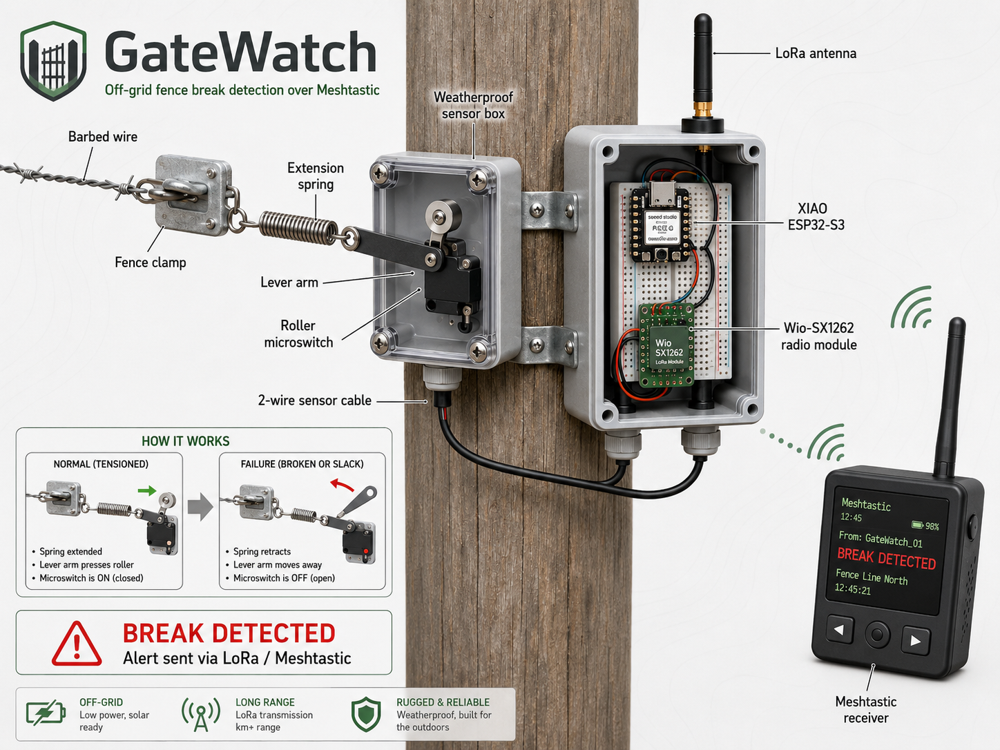

# GateWatch



> **Current status:** hardware and firmware prototype in progress. The images in `assets/concepts/` are concept renderings, not photographs of a completed field unit. Real build photos, serial logs, range results, and a demonstration video will be added as testing progresses.

GateWatch is an off-grid fence integrity and activity monitor for farms, ranches, and remote property. A mechanical tension switch watches a barbed-wire fence section without electrically connecting the radio electronics to the fence. A PIR sensor provides a second indication of nearby movement. Alerts are transmitted through Meshtastic using a Seeed Studio XIAO ESP32-S3 and Wio-SX1262 radio module.

## Why this exists

A broken or slack fence may allow livestock to escape or create a security problem. Many fence lines are outside dependable cellular and Wi-Fi coverage. GateWatch is intended to provide a small, low-power field node that reports:

- `FENCE BREAK`
- `FENCE RESTORED`
- `MOTION DETECTED`
- `MOTION NEAR BROKEN FENCE`
- periodic status heartbeats
- a direct reply to `GW STATUS`

No cloud service or AI model is required for the core function.

## Project goals

| Goal | Status |
|---|---|
| Mechanical fence-tension sensor design | Designed; physical prototype pending |
| PIR motion input with cooldown | Implemented in prototype logic |
| XIAO ESP32-S3 + bare Wio-SX1262 wiring | Documented; bench validation pending |
| Standalone RadioLib smoke test | Source included; hardware build pending |
| Meshtastic firmware overlay | Source included; CI build validation pending |
| Desktop state-machine tests | Passing |
| Outdoor range and reliability test | Not started |
| Real prototype photos and demo video | Not started |

## Hardware

- Seeed Studio XIAO ESP32-S3
- Seeed Studio Wio-SX1262 bare radio module
- matched 868/915 MHz antenna for the configured region
- normally-closed roller-lever microswitch
- extension spring, lever, fence clamp, and weatherproof sensor box
- 3.3 V-compatible PIR motion sensor
- stable 3.3 V supply with local bulk and ceramic decoupling
- breadboard or perfboard for bench testing
- purpose-built carrier PCB for field use

The bare Wio-SX1262 is a surface-mount module. It cannot plug directly into a breadboard without a breakout, carrier PCB, or carefully strain-relieved wiring.

## System flow

```text
Barbed-wire tension mechanism ──> NC microswitch ──┐
                                                   ├─> XIAO ESP32-S3
PIR motion sensor ─────────────────────────────────┘         │
                                                             │ SPI
                                                             v
                                                       Wio-SX1262
                                                             │
                                                     Meshtastic mesh
                                                             │
                                                             v
                                                  Farmer's receiver/phone
```

## Correct prototype pin map

| Function | XIAO label | ESP32-S3 GPIO |
|---|---|---:|
| Wio DIO1 | D1 | 2 |
| Wio NRST | D2 | 3 |
| Wio BUSY | D3 | 4 |
| Wio NSS / CS | D4 | 5 |
| Wio RF switch / RXEN | D5 | 6 |
| Wio SCK | D8 | 7 |
| Wio MISO | D9 | 8 |
| Wio MOSI | D10 | 9 |
| Fence NC switch | D6 | 43 |
| PIR output | D7 | 44 |

See [`docs/WIRING.md`](docs/WIRING.md) before connecting hardware. The concept graphics are not authoritative wiring diagrams.

## Repository map

```text
assets/concepts/                 Ten concept renderings
firmware/radio_sensor_smoke_test Standalone RadioLib bench firmware
firmware/meshtastic-overlay      Custom Meshtastic variant and GateWatch module
docs/                            Build, wiring, safety, sensors, and test records
hardware/                        BOM and accurate wiring reference
simulator/                       Desktop state-machine model and tests
scripts/                         GitHub push and verification helpers
```

## Start testing

Read [`START_HERE.md`](START_HERE.md), then follow this order:

1. Review [`docs/SAFETY.md`](docs/SAFETY.md).
2. Build the breakout or carrier for the bare Wio-SX1262.
3. Wire the radio using [`docs/WIRING.md`](docs/WIRING.md).
4. Attach the correct antenna before transmitting.
5. Flash the standalone smoke test.
6. Verify fence and PIR state changes in the serial monitor.
7. Run the Meshtastic build workflow.
8. Record real test evidence in [`docs/FIELD_TEST_LOG_TEMPLATE.md`](docs/FIELD_TEST_LOG_TEMPLATE.md).

Desktop logic tests:

```bash
python -m unittest discover -s simulator -v
```

## Firmware tracks

### Standalone RadioLib smoke test

`firmware/radio_sensor_smoke_test/` tests the radio wiring and both sensors with ordinary point-to-point LoRa packets. It is deliberately separate from Meshtastic so hardware faults can be isolated first.

### Meshtastic overlay

`firmware/meshtastic-overlay/` adds:

- a custom `gatewatch-xiao-s3` hardware environment
- corrected exposed-header wiring for the bare Wio-SX1262
- fence and PIR input handling
- alert prioritization and message spacing
- heartbeat/status reporting
- `GW STATUS` and `GW HELP` commands

The overlay targets the current upstream Meshtastic source tree and is built by GitHub Actions. Until the workflow passes and real hardware is tested, treat this as development firmware rather than a finished release.


## License

GateWatch project code is released under GPL-3.0-or-later. Meshtastic and third-party libraries remain subject to their own upstream licenses.
